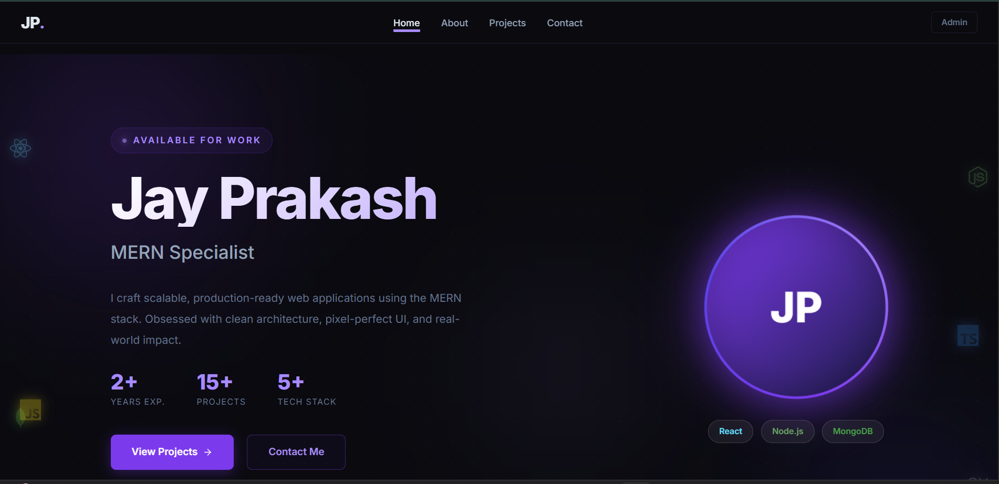

# 🚀 Portfolio V2 — MERN Developer Portfolio

A modern full-stack developer portfolio built with the MERN stack featuring a responsive UI, dynamic project management system, and admin dashboard.

---

## 🌐 Live Demo

🔗 Live Website: https://future-fs-01-tan-chi.vercel.app/

🔗 GitHub Repository: https://github.com/Mr-Zenn/FUTURE_FS_01

---

## ✨ Features

- Modern responsive UI
- MERN stack architecture
- Admin dashboard
- Dynamic project management
- Frontend / Full Stack filtering
- MongoDB integration
- Authentication system
- GitHub & Live project links
- Dark futuristic theme

---

## 🛠️ Tech Stack

### Frontend
- React.js
- Vite
- React Router
- CSS3

### Backend
- Node.js
- Express.js
- MongoDB Atlas
- JWT Authentication

### Deployment
- Vercel
- Render

---

## 📸 Screenshot



---

## 📂 Project Structure

```bash
portfolio-v2/
├── client/      # Frontend
├── server/      # Backend
└── README.md
```

---

## ⚙️ Installation

### Clone Repository

```bash
git clone https://github.com/Mr-Zenn/FUTURE_FS_01.git
cd FUTURE_FS_01
```

### Frontend Setup

```bash
cd client
npm install
npm run dev
```

### Backend Setup

```bash
cd server
npm install
npm run dev
```

---

## 👨‍💻 Developer

### Jay Prakash

- GitHub: https://github.com/Mr-Zenn
- LinkedIn: https://www.linkedin.com/in/jayprakash-sahu-06b501290

---

⭐ If you liked this project, consider giving it a star on GitHub!
